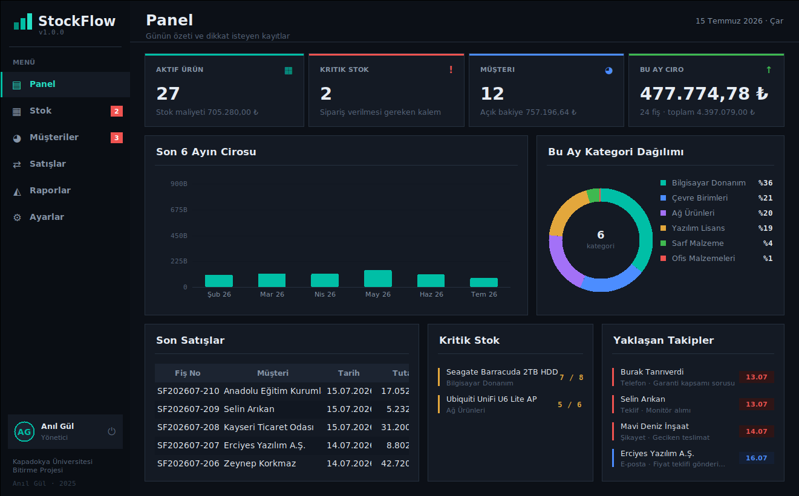
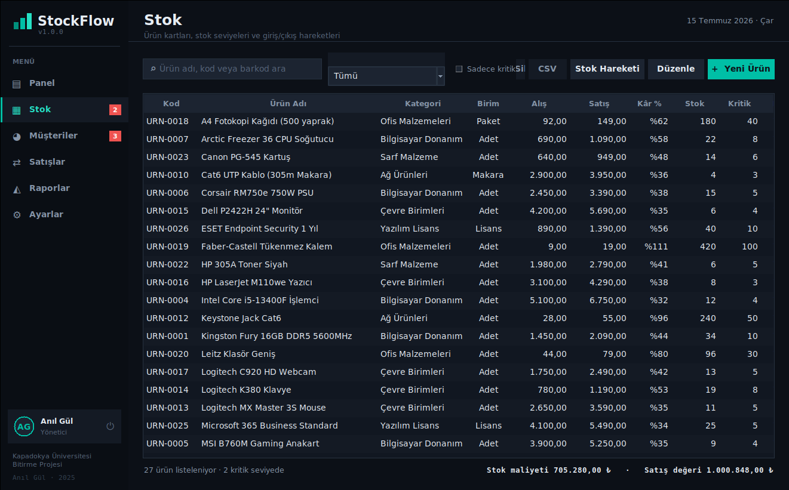
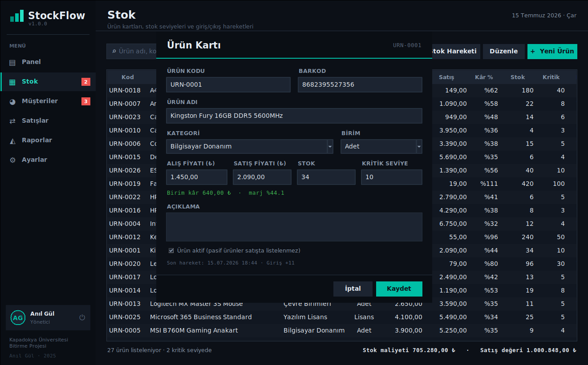
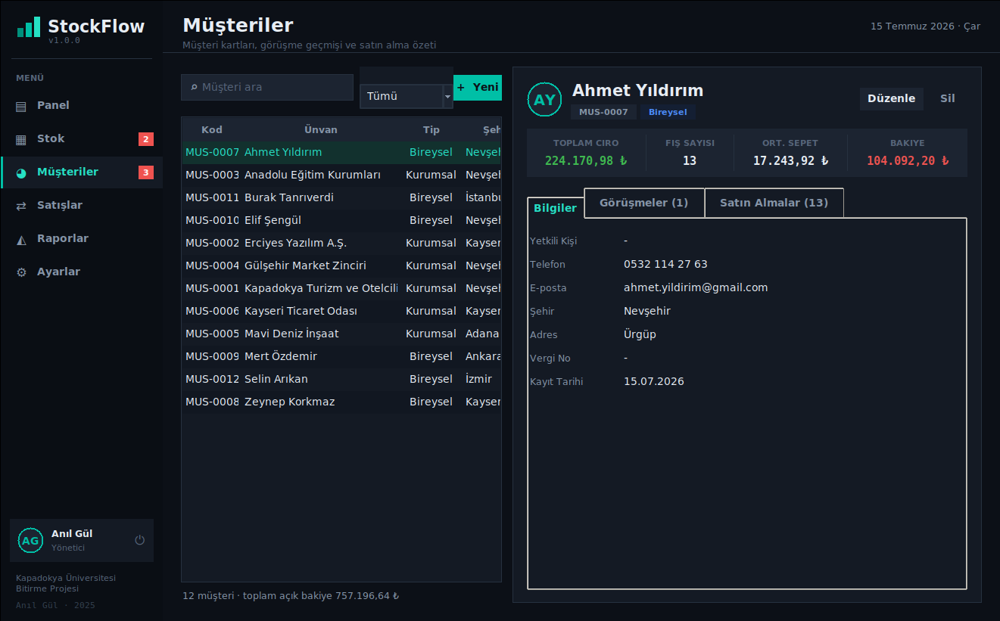
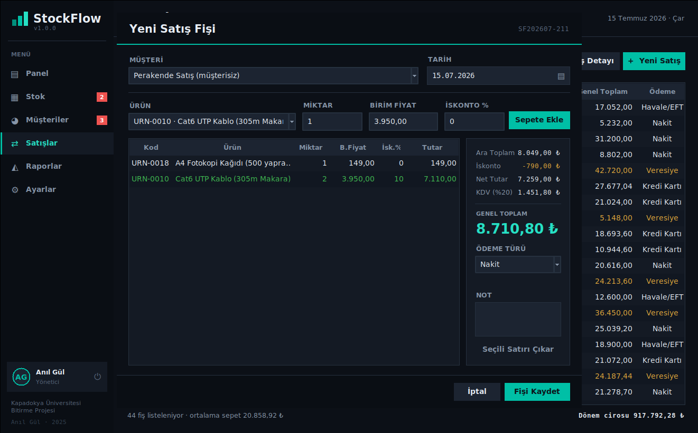
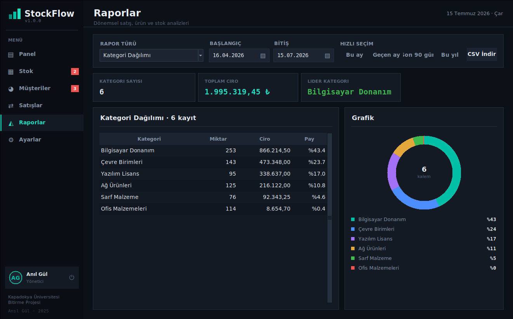
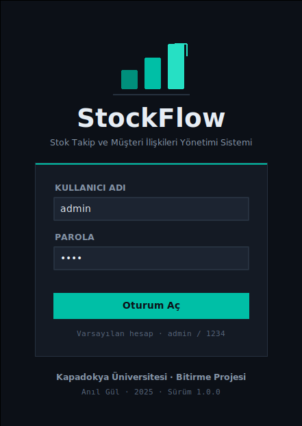

<p align="center">
  
</p>

<p align="center">
  
  
  
  
  
  
</p>

---

Küçük ve orta ölçekli bir işletmenin stoğunu ve müşteri ilişkilerini tek pencereden yönetmesi için yazdığım masaüstü uygulaması. Ürün kartları, satış fişleri, cari bakiye, görüşme geçmişi ve raporlar aynı yerde duruyor.

Kurulum gerektirmiyor. Bilgisayarda Python varsa `StockFlow.pyw` dosyasına çift tıklamanız yeterli. Kurulum sihirbazı, `pip install`, sunucu, hesap açma adımı yok. Veriler uygulamanın yanındaki `veri/` klasöründe bir SQLite dosyasında tutuluyor, isterseniz o dosyayı kopyalayıp başka makineye taşıyabilirsiniz.

<p align="center">
  
</p>

## Neden bağımlılık yok

Bitirme projesi olarak teslim edilen bir yazılımın, teslim edildikten iki yıl sonra da açılması gerekiyor. `pip install` ile çekilen paketler sürüm çakışmasına giriyor, PyPI'dan kaldırılabiliyor, kurulduğu makinede derleyici istiyor. Bu yüzden her şeyi standart kütüphaneyle yazdım:

| İhtiyaç | Kullandığım şey |
|---|---|
| Arayüz | `tkinter` ve `tkinter.ttk` |
| Veritabanı | `sqlite3` |
| Parola saklama | `hashlib` (PBKDF2-SHA256, 120.000 tur, kayıt başına tuz) |
| Grafikler | Elle çizilmiş `tkinter.Canvas` (sütun ve halka grafik) |
| Tarih seçici | Elle yazılmış takvim bileşeni |
| Dışa aktarma | `csv` |

matplotlib, tkcalendar, Pillow, SQLAlchemy gibi paketlerin hiçbiri yok. Bunun bedeli grafikleri ve takvimi kendim çizmek oldu, karşılığında da Python kurulu olan her makinede tek tıkla açılan bir program çıktı.

## Ekranlar

### Panel

Günün özeti. Aktif ürün sayısı, kritik seviyeye düşen kalemler, açık cari bakiye, bu ayın cirosu. Altında son altı ayın ciro grafiği, kategori dağılımı, son satışlar ve takip tarihi yaklaşan görüşmeler.


### Stok

Ürün kartları, kategori filtresi, kritik seviye takibi. Kâr yüzdesi alış ve satış fiyatından otomatik çıkıyor. Her giriş ve çıkış `stok_hareketleri` tablosuna işleniyor, yani bir ürünün stoğu neden 12 olmuş diye sorduğunuzda cevabı görebiliyorsunuz.



Ürün kartında alış ve satış fiyatını girdiğiniz anda birim kâr ile marj hesaplanıyor:



### Müşteriler

Sol tarafta liste, sağ tarafta seçili müşterinin kartı. Üç sekme var: iletişim bilgileri, görüşme geçmişi ve o müşterinin bütün satın almaları. Toplam ciro, fiş sayısı, ortalama sepet ve açık bakiye kartın üstünde duruyor.



### Satışlar

Fiş kesme ekranı. Ürünü seçip sepete atıyorsunuz, satır bazında iskonto verebiliyorsunuz, KDV ayarlardaki orandan hesaplanıyor. Ödeme türü veresiye seçilirse tutar müşterinin bakiyesine borç olarak yazılıyor ve müşteri seçmeden fişi kaydedemiyorsunuz.



### Raporlar

Altı rapor türü var: satış özeti, en çok satan ürünler, en iyi müşteriler, kategori dağılımı, stok durumu ve ödeme türü dağılımı. Tarih aralığını elle girebilir ya da hazır aralıklardan seçebilirsiniz. Her raporun yanında grafiği, altında da CSV çıktısı var.



CSV dosyalarını `utf-8-sig` ile yazıyorum. Düz `utf-8` yazınca Excel Türkçe karakterleri bozuyor, BOM eklenince düzgün açılıyor.

## Kurulum

Python 3.8 veya üzeri gerekiyor. Kontrol etmek için komut satırına `python --version` yazın.

Python yoksa [python.org](https://www.python.org/downloads/) adresinden indirin. Windows kurulumunda **Add python.exe to PATH** kutusunu işaretleyin, kurulum bileşenleri arasında **tcl/tk and IDLE** seçili kalsın. Bu ikincisi tkinter'ı getiriyor, kaldırırsanız uygulama açılmaz.

Sonra bu depoyu indirin:

```bash
git clone https://github.com/anilg12/StockFlow.git
cd StockFlow
```

Zip olarak indirdiyseniz klasörü istediğiniz yere çıkarın.

### Çalıştırma

**Windows:** `StockFlow.pyw` dosyasına çift tıklayın. `.pyw` uzantısı `pythonw.exe` ile eşleşiyor, o yüzden arkada siyah konsol penceresi açılmıyor.

Masaüstü kısayolu için dosyaya sağ tıklayın, **Gönder** > **Masaüstü (kısayol oluştur)**.

Bir sorun çıkarsa ve hata mesajını görmek isterseniz `StockFlow.bat` dosyasını kullanın, o konsol penceresini açık tutuyor.

**Linux / macOS:**

```bash
python3 StockFlow.pyw
```

ya da `./calistir.sh`

Linux'ta tkinter ayrıca kurulmuş olmayabilir:

```bash
sudo apt install python3-tk
```

**Modül olarak:**

```bash
python -m stockflow
```

### İlk açılış

Varsayılan hesap:

```
kullanıcı adı : admin
parola        : 1234
```

Parolayı Ayarlar > Güvenlik sekmesinden değiştirin.

Veritabanı boşsa uygulama ilk açılışta örnek veri üretiyor: 27 ürün, 12 müşteri, altı aya yayılmış yaklaşık 210 satış fişi, stok hareketleri ve görüşme kayıtları. Böylece panel ve raporlar boş ekran yerine dolu geliyor. Kendi verinizle başlamak isterseniz Ayarlar > Veri sekmesinden sıfırlayabilirsiniz.



## Klasör yapısı

```
StockFlow/
├── StockFlow.pyw            çift tıklanan başlatıcı
├── StockFlow.bat            konsollu başlatıcı (Windows)
├── calistir.sh              başlatıcı (Linux / macOS)
├── stockflow/
│   ├── __init__.py          sürüm ve künye sabitleri
│   ├── __main__.py          python -m stockflow
│   ├── uygulama.py          Tk kökü, oturum geçişleri, hata yakalama
│   ├── cekirdek/
│   │   ├── veritabani.py    şema, bağlantı, işlem yönetimi, parola, yedek
│   │   ├── servisler.py     iş kuralları (arayüzden bağımsız)
│   │   ├── yardimcilar.py   para ve tarih biçimleme, Türkçe küçültme, CSV
│   │   └── demo.py          ilk açılış örnek verisi
│   └── arayuz/
│       ├── tema.py          renk paleti, font seçimi, ttk stilleri
│       ├── bilesenler.py    buton, kart, tablo, grafik, takvim, dialog
│       ├── giris.py         oturum açma ekranı
│       ├── ana_pencere.py   kenar çubuğu ve sayfa yönlendirme
│       └── sayfalar/        panel, stok, musteri, satis, rapor, ayarlar
├── assets/                  banner ve ekran görüntüleri
└── veri/                    SQLite dosyası ve yedekler (ilk açılışta oluşur)
```

Bölünme şu kurala göre: `cekirdek/` içindeki hiçbir dosya `tkinter` import etmiyor, `arayuz/` içindeki hiçbir dosya SQL yazmıyor. Arayüz servis çağırıyor, servis veritabanı katmanını çağırıyor. Bu sayede iş kurallarını arayüzü açmadan test edebiliyorum.

## Veri modeli

```
kategoriler ──< urunler ──< stok_hareketleri
                   │
                   └──< satis_kalemleri >── satislar >── musteriler ──< gorusmeler
                                                │
                                           kullanicilar
```

Dokuz tablo var: `kullanicilar`, `kategoriler`, `urunler`, `musteriler`, `satislar`, `satis_kalemleri`, `stok_hareketleri`, `gorusmeler`, `ayarlar`.

Birkaç karar açıklama istiyor:

**Satış kalemleri ürün adını kopyalıyor.** `satis_kalemleri` tablosunda `urun_id` ile birlikte `urun_kod` ve `urun_ad` da duruyor. Normalleştirme kuralına aykırı görünüyor ama kasıtlı: ürün silinince `urun_id` NULL'a düşüyor, geçmiş fiş yine de "Logitech MX Master 3S Mouse" yazmaya devam ediyor. Fiş, kesildiği andaki durumun kaydı. Sonradan ürünün adı değişse bile eski fişin değişmemesi gerekiyor.

**Stok kolonu tek bir fonksiyondan güncelleniyor.** `urunler.stok` değerine sadece `servisler.stok_hareketi()` dokunuyor. Satış, iade, sayım farkı, fire, hepsi oradan geçiyor ve her geçiş `stok_hareketleri` tablosuna öncesi ve sonrası ile yazılıyor. Stoğun neden o değerde olduğu her zaman izlenebilir.

**Fiş iptali fişi siliyor.** İptal edilen fiş `durum = 'İptal'` işaretiyle durmuyor, tamamen siliniyor. Yerine stok hareketleri tablosunda "SF202607-118 nolu fiş iptali" açıklamalı iade kayıtları kalıyor. Bunu seçtim çünkü iptal bayrağı taşımak bütün ciro sorgularına `WHERE durum != 'İptal'` eklemeyi gerektiriyor ve bir yerde unutulduğu anda rapor yanlış çıkıyor.

**Yazma işlemleri parça parça değil.** Fiş kaydı sırasında başlık yazılıp kalemlerden biri stok kuralına takılırsa geride yarım fiş kalırdı. `veritabani.islem()` bağlam yöneticisi bu tür çok adımlı yazmaları tek parçaya çeviriyor, ortasında hata çıkarsa hiçbiri kalmıyor.

## İş kuralları

Servis katmanı `IsKurali` istisnası fırlatıyor, arayüz bunu yakalayıp kullanıcıya düz bir uyarı kutusunda gösteriyor. Traceback kullanıcıya gitmiyor.

Uygulanan kurallar:

- Stok eksiye düşemez. Çıkış hareketi mevcut stoğun üstündeyse reddediliyor.
- Sepette aynı ürün iki satırda olabilir. Kontrol satır bazında değil ürün bazında toplanarak yapılıyor, yoksa iki satırın toplamı stoğu aşıyor ama tek tek bakınca ikisi de geçerli görünüyor.
- Veresiye satış müşterisiz kesilemez. Aksi halde fiş "veresiye" yazar ama borç kimseye yazılmaz.
- Stok kodu ve müşteri kodu benzersiz.
- E-posta girildiyse biçimi kontrol ediliyor, boş bırakılabiliyor.
- Kritik seviyenin altına düşen ürünler kenar çubuğunda rozetle sayılıyor.

## Klavye

| Tuş | İş |
|---|---|
| `Ctrl` + `1` … `6` | Sayfalar arası geçiş |
| `F5` | Aktif sayfayı yenile |
| `Enter` | Dialogda kaydet |
| `Esc` | Dialogu kapat |
| `Delete` | Seçili satırı sil |
| Sütun başlığına tık | O sütuna göre sırala |

## Yedekleme

Ayarlar > Veri sekmesinde üç düğme var. Yedek al, veritabanının o anki kopyasını `veri/yedek/` klasörüne tarih damgalı olarak yazıyor. Geri yükle, seçtiğiniz yedek dosyasını aktif veritabanının yerine koyuyor. Sıfırla, bütün kayıtları silip boş bir veritabanı bırakıyor.

Kopya alırken dosyayı elle kopyalamıyorum, SQLite'ın kendi `backup()` çağrısını kullanıyorum. WAL modunda açık bağlantı varken dosyayı kopyalamak bozuk yedek üretebiliyor.

## Test

Uygulamayı Xvfb altında başlatıp bütün sayfaları ve dialogları gezerek, sonra da yazma işlemlerini gerçek veritabanına uygulayarak test ettim. Kontrol edilen davranışlar arasında ürün kaydı ve güncellemesi, mükerrer kod reddi, stok giriş ve çıkış hareketleri, negatif stok engeli, geçersiz e-posta reddi, satışın stoğu düşürmesi, veresiye tutarının bakiyeye işlenmesi, iskonto ve KDV hesabı, fiş iptalinde stok ve bakiye iadesi, ürün silindiğinde geçmiş fişin okunabilir kalması, yedek alma, parola değiştirme, CSV çıktısının Türkçe karakterleri ve oturum açma kapama döngüsü var.

Bu turda üç kusur çıktı ve düzeltildi: fiş kaydı atomik değildi, fiş numarası iki ayrı yerde üretiliyordu ve veresiye müşteri zorunluluğu yalnızca arayüzde vardı.

## Bilinen sınırlar

Uygulama tek kullanıcılı. Veritabanı dosyasını ağ paylaşımına koyup iki makineden aynı anda açmak SQLite'ın kilit davranışı yüzünden sorun çıkarır.

Fiş yazdırma yok, çıktı CSV üzerinden alınıyor. Barkod alanı ürün kartında var ama okuyucu entegrasyonu yok, alan elle dolduruluyor.

Arayüz 1120x700'ün altına inmiyor. Daha küçük ekranlarda tablolar sıkışır.

## Lisans

MIT. Ayrıntı için [LICENSE](LICENSE) dosyasına bakın.

---

<p align="center">
  <sub>Kapadokya Üniversitesi · Bitirme Projesi</sub><br>
  <sub><b>Anıl Gül</b> · 2025</sub>
</p>
